# UniFi Log Insight

Real-time log analysis for UniFi routers and gateways - captures syslog over UDP, parses firewall, DHCP, Wi-Fi, and system events, enriches them with GeoIP, ASN, threat intelligence, and reverse DNS, then serves everything through a live Dashboard.

Single Docker container. No external dependencies. Zero data collection.

> **For full documentation — installation, configuration, integrations, and more — visit [insightsplus.dev/docs](https://insightsplus.dev/docs).**

<a href="#-features">Features</a> · <a href="#-prerequisites">Prerequisites</a> · <a href="#-app-screenshots">Screenshots</a>

---

## ✨ Features

| Feature | Description |
|---------|-------------|
| **Live Log Stream** | Auto-refreshing table with expandable details, copy-to-clipboard, and intelligent pause/resume |
| **Flow View** | Interactive Sankey flow graph and Zone Matrix showing how traffic moves between sources, services, and destinations. Click any node to cross-filter, drill into a host slide panel for per-IP breakdowns, and save/load custom views |
| **Threat Map** | Interactive world map showing where threats and blocked outbound traffic originate. Switch between heatmap and cluster views, filter by time range, and click any point to inspect individual logs |
| **Dashboard** | Traffic breakdowns, top blocked/allowed countries and IPs, top threats with ASN/city/rDNS/categories, top devices, services, DNS queries |
| **Filters** | Log type, time range, action, direction, VPN badge, interface, service, country, ASN, threat score, IP, rule name, text search |
| **IP Enrichment** | GeoIP (country, city, coordinates), ASN, reverse DNS via MaxMind GeoLite2 with scheduled auto-update and hot-reload |
| **AbuseIPDB Integration** | Threat scoring (23 categories, Tor detection, usage type), daily blacklist pre-seeding, automatic backfill |
| **Syslog Receiver** | UDP 514 listener parsing firewall, DHCP, Wi-Fi, DNS, and system events |
| **Multi-WAN & Direction** | Per-interface WAN IP mapping for failover/load-balanced setups. Auto-classifies traffic as inbound, outbound, inter-VLAN, local, or VPN |
| **VPN Detection** | Auto-detects VPN interfaces (WireGuard, OpenVPN, Teleport, Site Magic) with badge assignment, labels, and CIDRs |
| **UniFi Integration** | Network discovery, device name resolution, and firewall syslog management via **UniFi OS** (API key) or **self-hosted controllers** (username/password) |
| **Firewall Syslog Manager** | Zone matrix with bulk toggle — enable syslog on firewall rules without leaving the app (UniFi OS) |
| **AI Agent Integration** *(MCP)* | Connect Claude Desktop, Claude Code, Gemini CLI (or any http mcp client) via the [Model Context Protocol (MCP)](https://insightsplus.dev/docs) to query your network data & setup through natural conversation |
| **Device Names** | Friendly names from UniFi clients/devices with historical backfill |
| **Theming & Preferences** | Dark/light theme, country display format, IP subline (show ASN beneath IPs) |
| **Interface Labels** | Color-coded labels for traffic flow, applied retroactively to all logs |
| **CSV Export** | Download filtered results up to 100K rows |
| **Retention** | Configurable per log type (60-day default, 10-day DNS). Adjustable via Settings or env vars |
| **Backup & Restore** | Export/import all settings as JSON |
| **DNS Ready** | Full DNS query parsing ([requires configuration](https://insightsplus.dev/docs)) |
| **Mobile Responsive** | Collapsible filters, full-width table on small screens |
| **Setup Wizard** | Two paths: **UniFi API** (auto-detects WAN, VLANs, topology) or **Log Detection** (discovers interfaces from live traffic) |

## 📋 Prerequisites

- **Docker** and **Docker Compose**
- **UniFi Router** (or any UniFi gateway that supports remote syslog)
- **MaxMind GeoLite2 account** ([free signup](https://www.maxmind.com/en/geolite2/signup)) - for GeoIP/ASN lookups
- **AbuseIPDB API key** ([free tier](https://www.abuseipdb.com/register?plan=free), optional) - for threat scoring

**Minimum host resources (estimated):**

- **CPU:** 2 cores/threads minimum (PostgreSQL + receiver + API run concurrently)
- **Disk:** 10 GB free for the database volume (`pgdata`) at minimum

These are baseline estimates for a small home network. Higher log volume or longer retention will require more disk.

## 📸 App Screenshots

#### Desktop

##### Log Stream
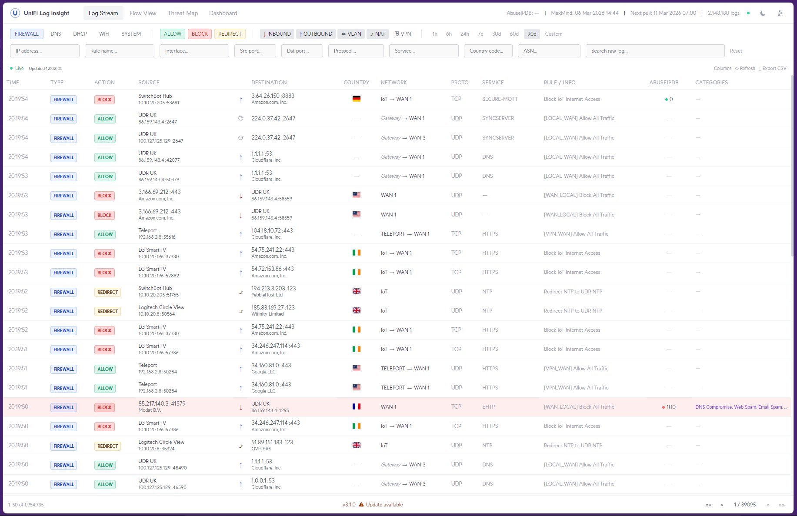

##### Expanded Log Detail
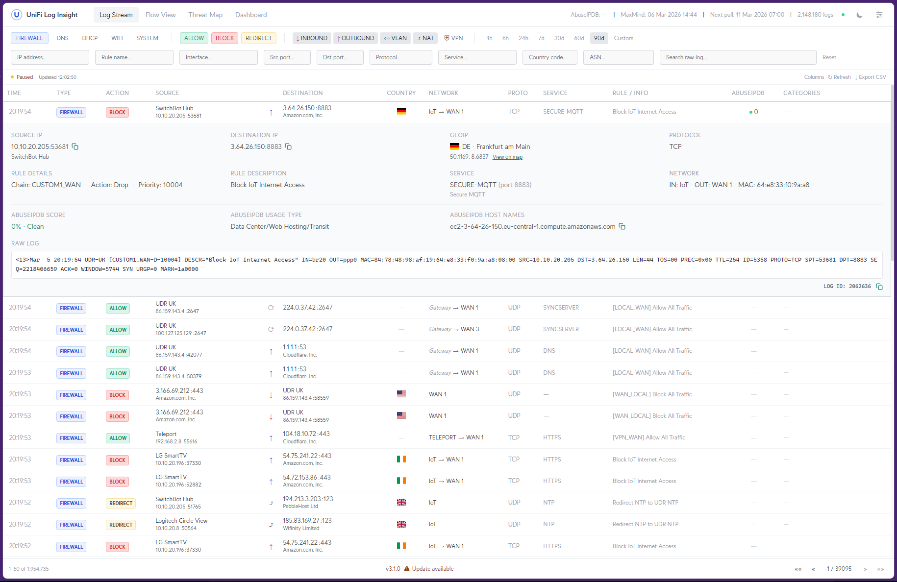

##### Dashboard
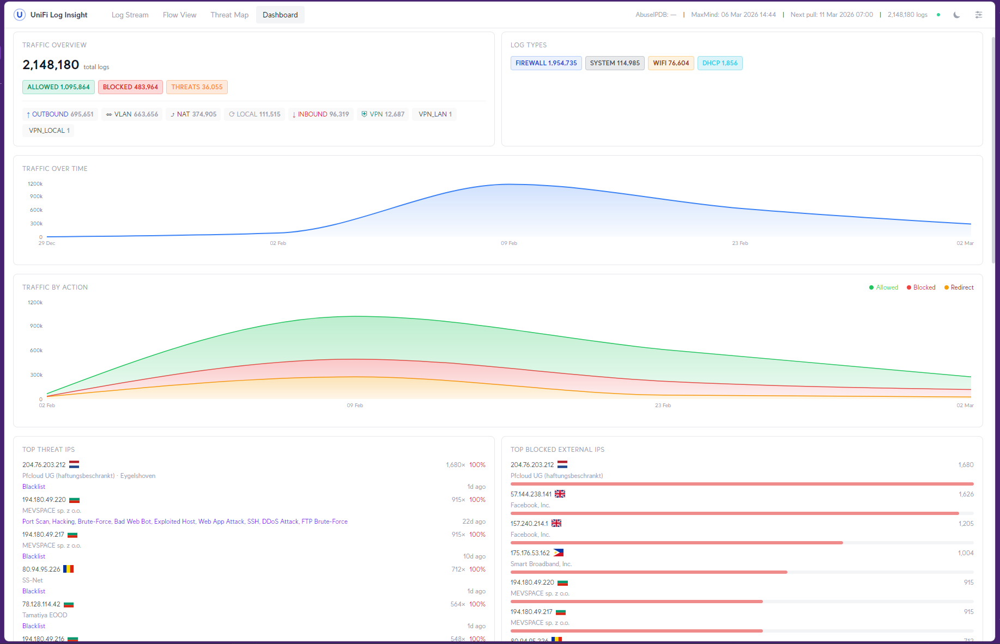

##### Dashboard — Top IPs
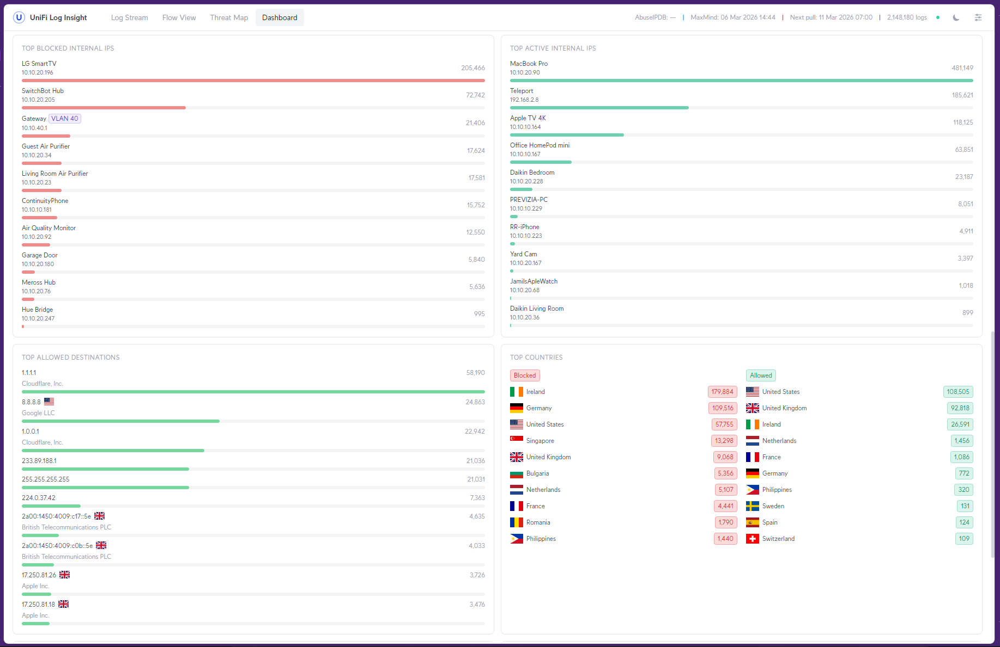

##### Flow View — Sankey Chart
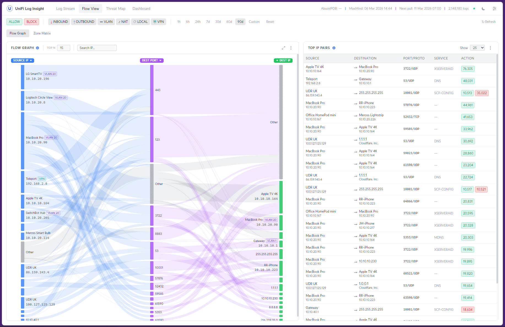

##### Flow View — Host Detail
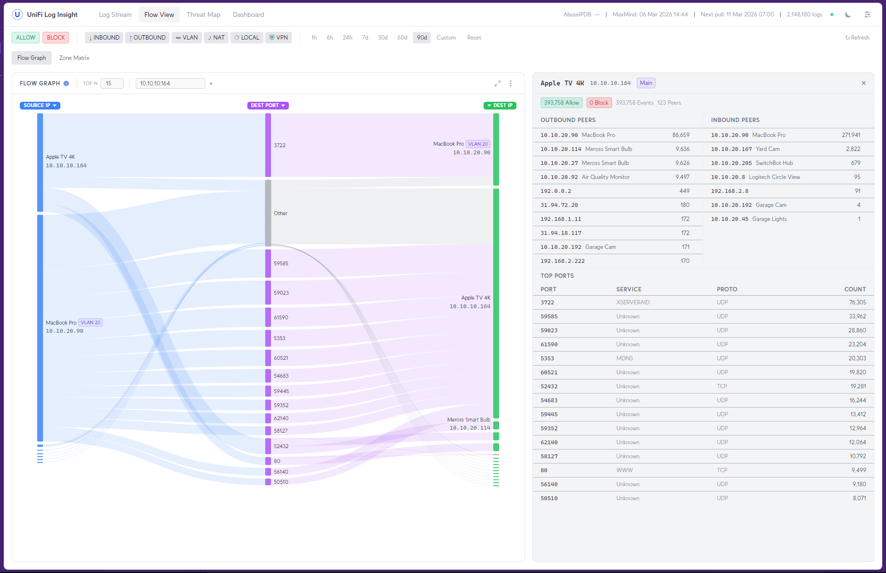

##### Flow View — Zone Matrix
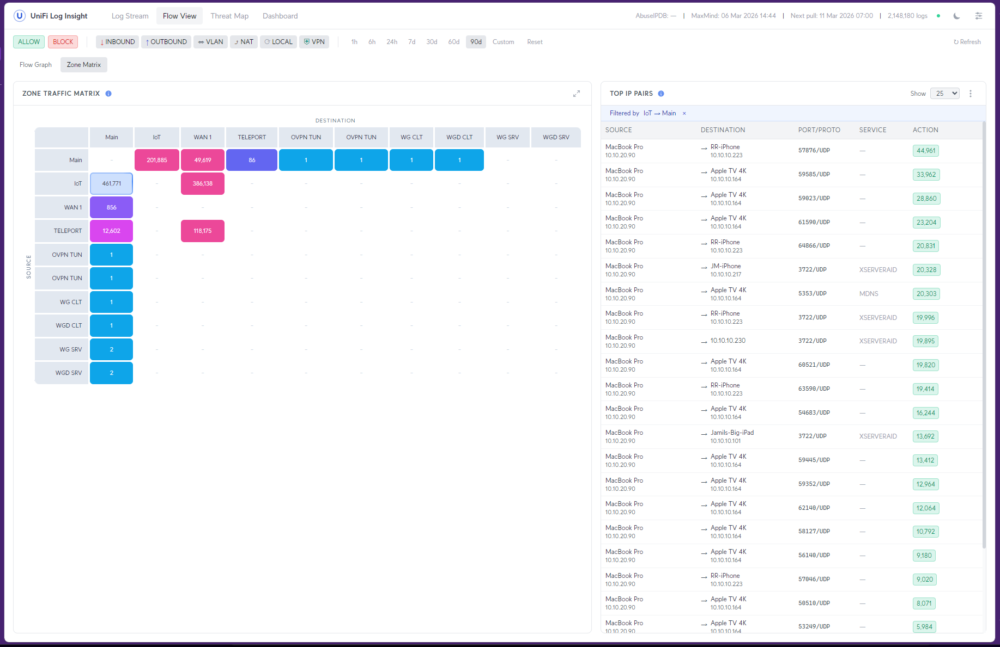

##### Threat Map — Heatmap
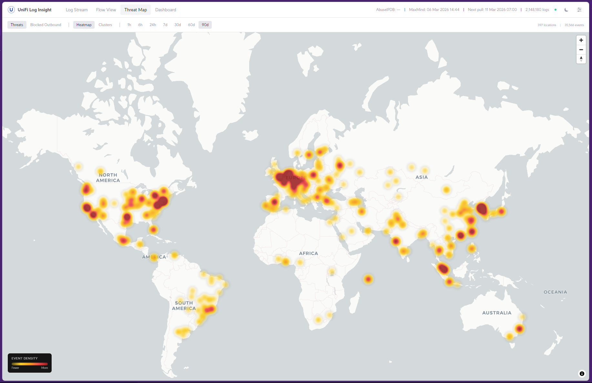

##### Threat Map — Clusters
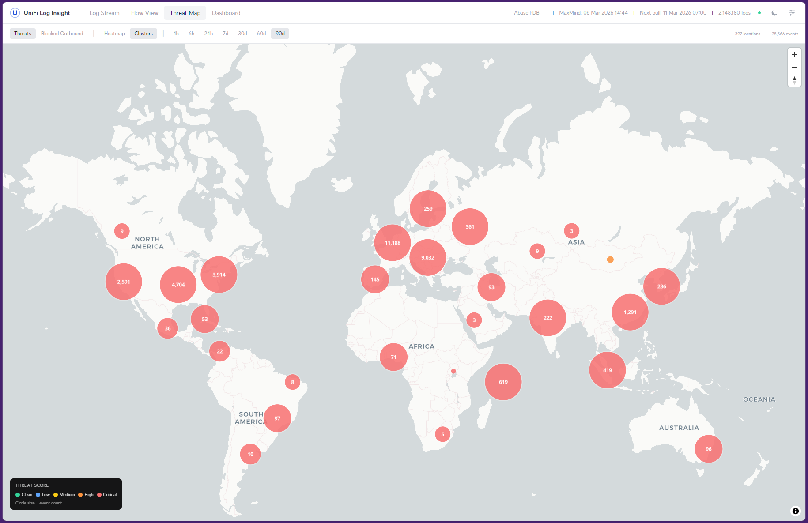

##### Threat Map — Event Detail Sidebar
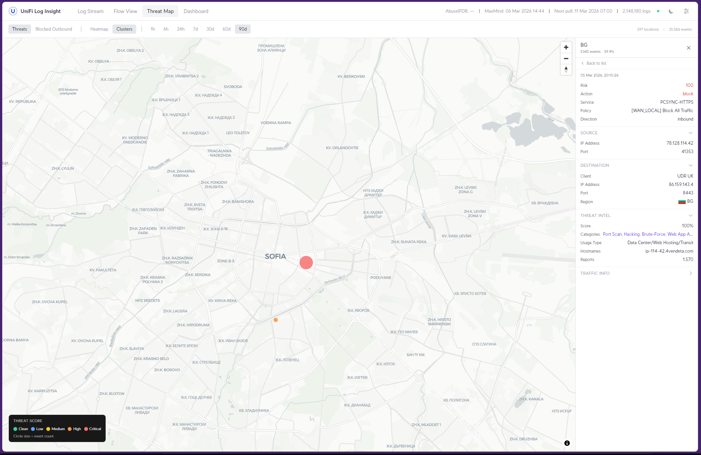

##### Firewall Syslog Matrix
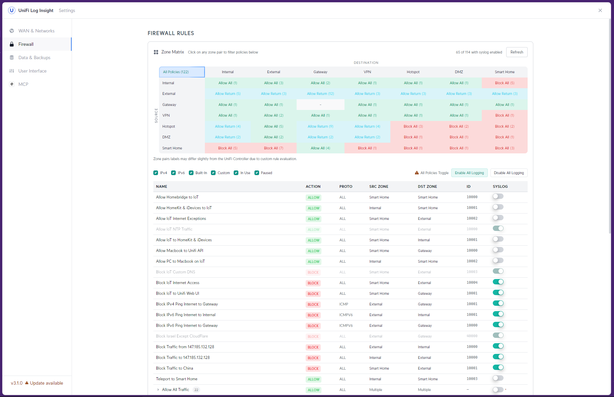

##### Settings
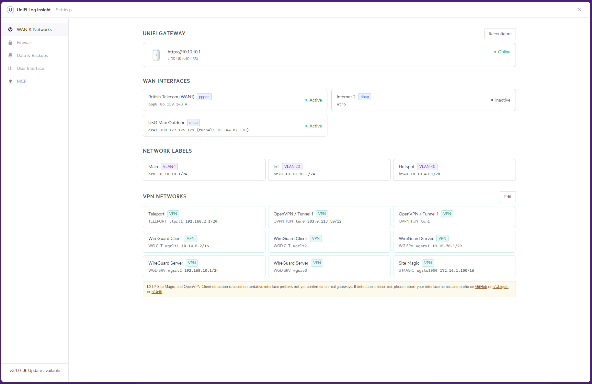

##### Dark Mode
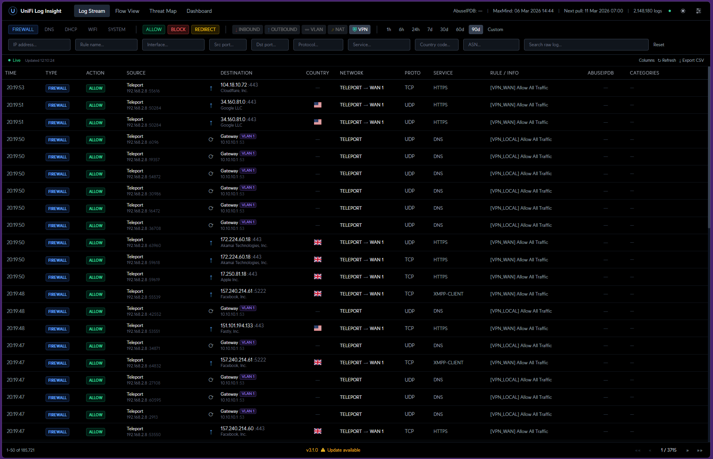

#### Mobile

##### Log Stream
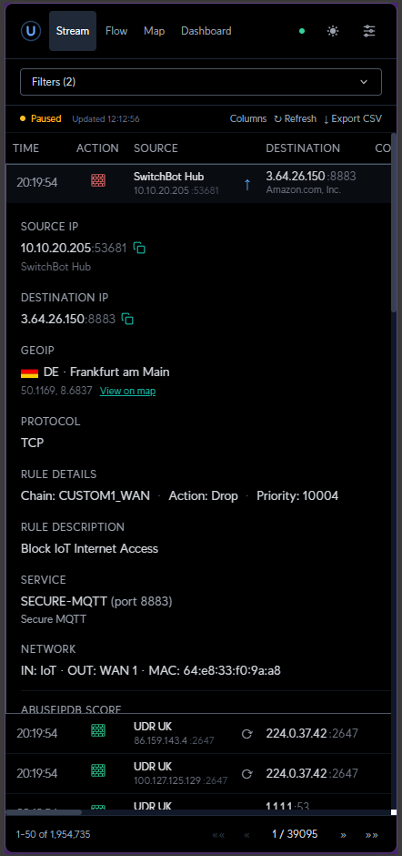

##### Flow View
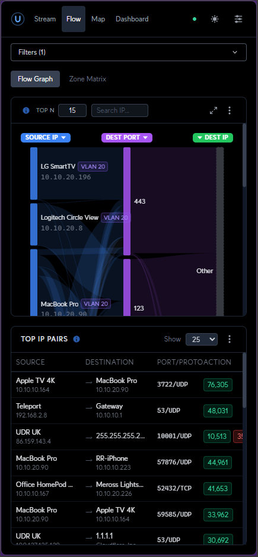

##### Dashboard
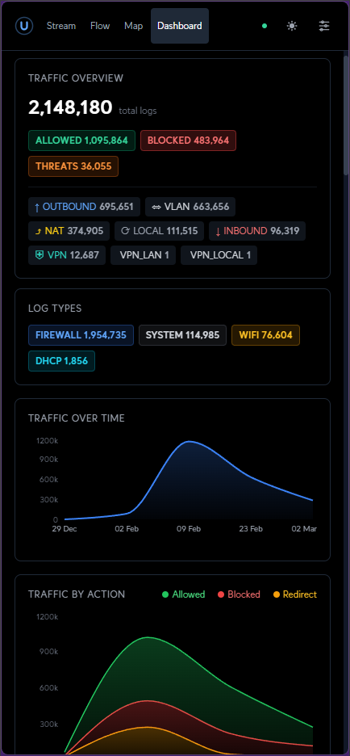

##### Threat Map
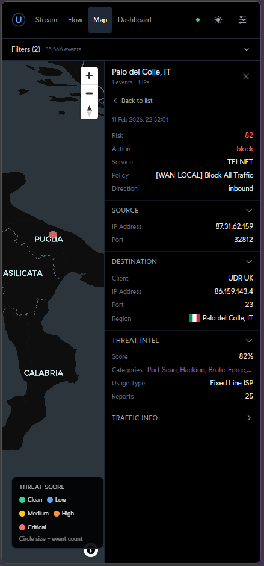

## 📄 License

Licensed under the [Business Source License 1.1](LICENSE) (BSL 1.1).

**You may** freely use, modify, and self-host UniFi Log Insight for non-commercial and internal business purposes.

**You may not** offer the Licensed Work to third parties on a hosted or embedded basis to compete with the Licensor's paid offerings without a commercial license.

Each version converts to **Apache License 2.0** four years after its release date.

Exceptions to the BSL terms may be granted on a case-by-case basis — contact the Licensor for inquiries.