# 🔍 UniFi Log Insight


Real-time log analysis for UniFi Routers (and Gateways). Receives syslog over UDP, parses firewall/DHCP/Wi-Fi/system events, enriches with GeoIP, ASN, threat intelligence, and reverse DNS, stores everything in PostgreSQL, and serves a live React dashboard.

Built for home network monitoring — runs as a single Docker container with zero external dependencies.

---


---

## ✨ Features

- 📡 **Syslog Receiver** — Listens on UDP 514, parses iptables firewall rules, DHCP leases, Wi-Fi events, and system messages
- 🌍 **IP Enrichment** — MaxMind GeoLite2 (country, city, coordinates), ASN lookup, AbuseIPDB threat intelligence (score, 23 attack categories, usage type, Tor/whitelist detection, report counts), reverse DNS
- 🧙 **Setup Wizard** — First-launch wizard auto-detects WAN interface(s) and network segments from live traffic, lets you label each interface (e.g., "IoT" instead of "br20"), and saves everything to the database — no config files to edit
- 🔀 **Multi-WAN Support** — Select multiple WAN interfaces for failover or load-balanced setups; reconfigure anytime via the Settings gear
- 🧭 **Smart Direction Detection** — Classifies traffic as inbound, outbound, inter-VLAN, or local with automatic WAN IP learning
- 🔤 **DNS Ready** — Parser supports DNS query/answer logging (requires additional Unifi configuration — see [DNS Logging](#-dns-logging) below)
- 📺 **Live UI** — Auto-refreshing log stream with expandable detail rows, intelligent pause/resume when inspecting logs
- 🔎 **Filters** — Filter by log type, time range, action (allow/block/redirect), direction, IP address, rule name, and raw text search
- 📊 **Dashboard** — Traffic breakdown by type and direction, logs-per-hour chart, top blocked countries/IPs (WAN IP and non-routable excluded), top threat IPs (enriched with ASN, city, rDNS, decoded categories, last seen), top DNS queries
- 🛡️ **AbuseIPDB Blacklist** — Daily pull of 10,000 highest-risk IPs pre-seeded into the threat cache for instant scoring without API calls (separate quota: 5 calls/day)
- 💾 **Persistent Threat Cache** — `ip_threats` table stores AbuseIPDB results (score, categories, usage type, Tor status, report counts) for 4-day reuse, surviving container rebuilds. Three-tier lookup: in-memory → PostgreSQL → API call
- 🔄 **Backfill Daemon** — Automatically patches historical logs that have NULL threat scores against the persistent cache
- 🛟 **Batch Insert Resilience** — Row-by-row fallback on batch failures; IP validation at parse time prevents bad data from blocking ingestion
- 🏷️ **Dynamic Interface Labels** — Color-coded, user-defined labels showing traffic flow direction; labels apply retroactively to all existing logs
- 🎛️ **Interface Filter** — Filter logs by network interface with multi-select, searching by both interface name and label
- 📥 **CSV Export** — Download filtered results up to 100K rows
- 🗑️ **Auto-Retention** — 60-day retention for firewall/DHCP/Wi-Fi, 10-day for DNS
- 🔁 **MaxMind Auto-Update** — Scheduled GeoLite2 database refresh with hot-reload (no restart needed)

---

## 📋 Prerequisites

- **Docker** and **Docker Compose** on the host machine
- **UniFi Router** (or any UniFi gateway that supports remote syslog)
- **Syslog enabled per firewall rule** — Each firewall rule you want to track must have syslog explicitly enabled in UniFi's Zone Policy Engine (Network App v.10+)
- **MaxMind GeoLite2 account** (free) — for GeoIP/ASN lookups
- **AbuseIPDB API key** (free tier, optional) — for threat scoring on blocked IPs
  
---
# 🚀 Quick Start

> 🖧 **Running Unraid?** Skip to the [Unraid Setup](#-unraid-setup) section for a no-terminal install guide.

## 1. Unifi Configuration (Start here)

### Configure Your Unifi Router Syslog

> **Note:** Without per-rule Syslog enabled (Step 2 below), firewall logs will not appear in UniFi Log Insight even if global Activity Logging is configured.

In your UniFi Network controller:

#### 1.1 Enable Traffic Logging

1. Go to **Settings → CyberSecure → Traffic Logging**
2. Enable **Activity Logging (Syslog)**
3. Under Contents, select Clients, Critical, Devices, Security Detections, Triggers, VPN, Firewall Default Policy.
4. Set the syslog server to the `<docker-host-ip>` on port `514`
5. Click Apply Changes.

#### 1.2 Enable Syslog Per Firewall Rule

Each firewall or traffic rule must have syslog individually enabled, or its logs won't be sent. As of UniFi Network App v.10+:

1. Go to **Settings**
2. Navigate to **Policy Engines → Zones**
3. Select a rule you want to monitor
4. Enable the **Syslog** toggle for that rule
5. Repeat for all rules you wish to track


## 2. Pull or Build the App's Image:

Choose between two installation options: Option A — Pull Pre-built Image or Option B — Build from Source. Both options require you to set the .env file.

#### Option A — Pull Pre-built Image (recommended)

No cloning or building required. Create a directory anywhere and add two files:

**`docker-compose.yml`**

```yaml
services:
  unifi-log-insight:
    image: ghcr.io/jmasarweh/unifi-log-insight:latest
    container_name: unifi-log-insight
    restart: unless-stopped
    ports:
      - "514:514/udp"
      - "8090:8000"
    volumes:
      - pgdata:/var/lib/postgresql/data
      - ./maxmind:/app/maxmind
    env_file:
      - .env

volumes:
  pgdata:
    name: unifi-log-insight-pgdata
```

**`.env`**

**Get the MaxMind GeoIP and AbuseIPDB Keys to add to .env file**

### Maxmind
**Auto-download (recommended):** Set `MAXMIND_ACCOUNT_ID` and `MAXMIND_LICENSE_KEY` in `.env`. If no `.mmdb` files exist on first boot, the container downloads them automatically.

**Manual download:** Download from your [MaxMind account](https://www.maxmind.com/en/accounts/current/geoip/downloads) and place in the `maxmind/` directory:
- `GeoLite2-City.mmdb`
- `GeoLite2-ASN.mmdb`

### AbuseIP
**Create a free account**: if you don't have one, signup to a free account from AbuseIPDB at https://www.abuseipdb.com/register?plan=free

**Create your API Key**: Once your account is created and you are logged in, navigate to https://www.abuseipdb.com/account/api and click on 'Create Key'
- Set `ABUSEIPDB_API_KEY` to the key you just copied from the site, into .env.


Your final .env should look like this:

```env
# PostgreSQL (required)
POSTGRES_PASSWORD=your_strong_password_here

# AbuseIPDB - free at https://www.abuseipdb.com/register (recommended)
ABUSEIPDB_API_KEY=your_key_here

# MaxMind GeoLite2 - free at https://www.maxmind.com/en/geolite2/signup (recommended)
MAXMIND_ACCOUNT_ID=your_account_id
MAXMIND_LICENSE_KEY=your_license_key

# Timezone for scheduled tasks (used by cron for MaxMind updates)
TZ=Europe/London

# Log level (DEBUG shows periodic stats and all access logs; default: INFO)
# LOG_LEVEL=INFO
```

Then run:

```bash
docker compose up -d
```

#### Option B — Build from Source

```bash
git clone https://github.com/jmasarweh/unifi-log-insight.git
cd unifi-log-insight
# Create .env as shown above
docker compose up -d --build
```

## 3. Open the UI

Navigate to `http://<docker-host-ip>:8090`

On first launch, a **Setup Wizard** will guide you through:

1. **WAN Detection** — Select your WAN interface(s) so the system can classify traffic as inbound, outbound, or inter-VLAN. Common interfaces:

   | UniFi Model | Typical WAN Interface |
   |---|---|
   | UDR (PPPoE) | `ppp0` |
   | UDR (DHCP) | `eth3` |
   | UDM / UDM-SE | `eth8` |
   | USG | `eth0` |
   | UDM-Pro | `eth8` or `eth9` |

2. **Network Labels** — Give each interface a friendly name (e.g., "IoT" instead of "br20").
3. **Summary** — Review and save.

You can reconfigure at any time via the **Settings gear** in the top-right corner of the UI.

---

## 🏗️ Architecture

Everything runs inside a single Docker container, managed by supervisord:

```mermaid
graph LR
    subgraph Docker Container
        direction TB

        subgraph Ingestion
            SR["📡 Syslog Receiver\nUDP :514"]
            EN["🌍 Enrichment\nGeoIP · ASN · AbuseIPDB · rDNS"]
        end

        subgraph Storage
            PG["🐘 PostgreSQL\nlogs · ip_threats"]
        end

        subgraph Serving
            API["⚡ FastAPI + React UI\n:8000"]
        end

        subgraph Background
            CRON["🕐 Cron\nMaxMind Updates"]
            SCHED["🔄 Scheduler\nBlacklist · Retention · Backfill"]
        end

        SR --> EN --> PG
        PG --> API
        SCHED --> PG
    end

    UDP["🔌 UDP :514\nsyslog in"] --> SR
    API --> HTTP["🌐 HTTP :8090\nUI + API out"]
```



### 🔀 Log Processing Pipeline

1. **Receive** — Raw syslog UDP packets from Unifi
2. **Parse** — Extract fields from iptables, hostapd, dhclient, and dnsmasq messages (when DNS logging is enabled)
3. **Validate** — IP address validation rejects malformed data before DB insert
4. **Classify** — Determine direction (inbound/outbound/inter-VLAN/local) based on interfaces and WAN IP
5. **Enrich** — GeoIP country/city/coords, ASN org name, AbuseIPDB threat score + categories + detail fields (verbose mode), reverse DNS
6. **Store** — Batched inserts into PostgreSQL with row-by-row fallback on failure
7. **Serve** — REST API with pagination, filtering, sorting, and CSV export

---

## ⚙️ Configuration Reference

### Environment Variables

| Variable | Description |
|---|---|
| `POSTGRES_PASSWORD` | PostgreSQL password for the `unifi` user |
| `ABUSEIPDB_API_KEY` | Enables threat scoring on blocked inbound IPs. Free tier: 1,000 check lookups/day + 5 blacklist pulls/day |
| `MAXMIND_ACCOUNT_ID` | Enables GeoIP auto-update. Without it, manually place `.mmdb` files |
| `MAXMIND_LICENSE_KEY` | Paired with account ID for auto-update |
| `TZ` | Timezone for cron schedules. Defaults to UTC. Examples: `Europe/London`, `Asia/Amman`, `America/New_York` |
| `LOG_LEVEL` | Logging verbosity: `DEBUG`, `INFO`, `WARNING`, `ERROR`, `CRITICAL`. Defaults to `INFO`. Set to `WARNING` for quiet steady-state. Use `DEBUG` for troubleshooting |

### Ports

| Port | Protocol | Purpose |
|---|---|---|
| 514 | UDP | Syslog receiver (incoming logs from Unifi) |
| 8090 | TCP | Web UI and REST API |

### Retention Policy

| Log Type | Retention |
|---|---|
| Firewall, DHCP, Wi-Fi, System | 60 days |
| DNS (when enabled) | 10 days |

Cleanup runs daily at 03:00 (container local time).

---

## 🗺️ MaxMind Auto-Update

When credentials are configured, GeoLite2 databases update automatically on **Wednesday and Saturday at 7:00 AM** (local time per `TZ`). This aligns with MaxMind's Tuesday/Friday publish schedule, giving a buffer for propagation.

The receiver hot-reloads databases via signal — no container restart required.

### Manual Update

```bash
docker exec unifi-log-insight /app/geoip-update.sh
```

### Check Update Logs

```bash
docker exec unifi-log-insight cat /var/log/geoip-update.log
```

---

## 🛡️ AbuseIPDB Integration

When `ABUSEIPDB_API_KEY` is configured, the system provides multi-layered threat intelligence:

### Threat Scoring

Blocked firewall events trigger a lookup against AbuseIPDB using verbose mode, returning:
- **Confidence score** (0–100%) with severity classification (Clean/Low/Medium/High/Critical)
- **Attack categories** — Decoded from 23 category codes (Port Scan, SSH, Brute-Force, DDoS, etc.)
- **Usage type** — Data Center, Residential, VPN, etc.
- **Tor exit node** detection
- **Whitelist** status
- **Report count** and last reported date

### Three-Tier Cache

To minimise API usage, lookups follow a cache hierarchy:

1. **In-memory cache** — Hot path, zero I/O
2. **PostgreSQL `ip_threats` table** — Persistent across container rebuilds, 4-day TTL
3. **AbuseIPDB API** — Only called on cache miss, results written back to both tiers

### Blacklist Pre-seeding

A daily pull of the AbuseIPDB blacklist (10,000 highest-risk IPs at 100% confidence) is bulk-inserted into the threat cache. Any blocked IP matching the blacklist gets an instant score from cache — no API call consumed. Uses a separate quota (5 calls/day) independent of the check quota.

The blacklist runs on startup (30-second delay) and then daily at 04:00.

### Rate Limiting

The system uses AbuseIPDB response headers (`X-RateLimit-Remaining`, `Retry-After`) as the single source of truth — no internal counters that desync on container rebuilds. On 429 responses, the enricher pauses automatically until the limit resets.

---

## 🖥️ UI Guide

### Log Stream

The main view shows a live-updating table of parsed logs:

- **Type filters** — Toggle firewall, DNS, DHCP, Wi-Fi, system
- **Time range** — 1h, 6h, 24h, 7d, 30d, 60d
- **Action filters** — Allow, block, redirect
- **Direction filters** — Inbound, outbound, VLAN, NAT
- **Interface filter** — Multi-select by interface name or label (e.g., "IoT", "br20")
- **Service filter** — Filter by detected service (HTTP, DNS, SSH, etc.)
- **Text search** — Filter by IP, rule name, or raw log content

Click any row to expand full details including enrichment data, parsed rule breakdown, AbuseIPDB intelligence (score, decoded attack categories, usage type, hostnames, report count, last reported date, Tor/whitelist status), and raw log.

The stream auto-pauses when a row is expanded and shows a count of new logs received. It resumes on collapse.

### Dashboard

Aggregated views with configurable time range:
- Total logs, blocked count, high-threat count
- Traffic direction breakdown
- Logs-per-hour bar chart
- Top blocked countries and IPs (WAN IP and 0.0.0.0 auto-excluded)
- Top threat IPs — enriched with ASN, city, rDNS, decoded attack categories, last seen
- Top DNS queries (when DNS logging is enabled)

---

## 📡 API Endpoints

| Endpoint | Description |
|---|---|
| `GET /api/logs` | Paginated log list with all filters |
| `GET /api/logs/{id}` | Single log detail with threat data |
| `GET /api/stats?time_range=24h` | Dashboard aggregations |
| `GET /api/export` | CSV export with current filters |
| `GET /api/health` | Health check with total count and latest timestamp |
| `GET /api/services` | Distinct service names for filter dropdown |
| `GET /api/interfaces` | Distinct interfaces seen in logs |
| `GET /api/config` | Current system configuration (WAN, labels, setup status) |
| `POST /api/setup/complete` | Save wizard configuration |
| `GET /api/setup/wan-candidates` | Auto-detected WAN interface candidates |
| `GET /api/setup/network-segments` | Discovered network segments with suggested labels |
| `POST /api/enrich/{ip}` | Force fresh AbuseIPDB lookup for an IP |

---

## 🔤 DNS Logging

The app includes full DNS query parsing, but **some Unifi Routers/Gateways do not send DNS logs by default**. Their dnsmasq instance lacks the `log-queries` directive, and its configuration is auto-generated by `ubios-udapi-server` — manual edits are overwritten on reboot.

**Current status:** There is no supported persistent method to enable DNS syslog on newer Unifi devices without workarounds that risk breaking on firmware updates.

**Options if you want DNS visibility:**

- **Pi-hole / AdGuard Home** — Deploy as your network's DNS server. These log all queries natively and also provide ad blocking. Point your router's DHCP to hand out the Pi-hole IP as the DNS server.
- **Wait for Ubiquiti** — A future firmware update may expose a DNS logging toggle. The app will capture DNS logs automatically once the router starts emitting them.

The dashboard includes a "Top DNS Queries" panel and the filter bar has a DNS type toggle — both will populate once DNS logs start flowing.

---

## 🖧 Unraid Setup

Install directly from Unraid's Docker UI — no terminal needed.

1. Go to the **Docker** tab and click **Add Container**
2. Set **Repository** to `ghcr.io/jmasarweh/unifi-log-insight:latest`
3. Set **Name** to `unifi-log-insight`
4. Add the following **Port Mappings**:

   | Container Port | Host Port | Type |
   |---|---|---|
   | `514` | `514` | UDP |
   | `8000` | `8090` | TCP |

5. Add the following **Volume Mappings**:

   | Container Path | Host Path | Purpose |
   |---|---|---|
   | `/var/lib/postgresql/data` | `/mnt/user/appdata/unifi-log-insight/pgdata` | Database storage |
   | `/app/maxmind` | `/mnt/user/appdata/unifi-log-insight/maxmind` | GeoIP databases (auto-downloaded) |

6. Add **Environment Variables**:

   | Key | Value |
   |---|---|
   | `POSTGRES_PASSWORD` | *(your password)* |
   | `TZ` | *(your timezone, e.g. `America/New_York`)* |
   | `ABUSEIPDB_API_KEY` | *(optional — get free key at [abuseipdb.com](https://www.abuseipdb.com/register))* |
   | `MAXMIND_ACCOUNT_ID` | *(optional — get free account at [maxmind.com](https://www.maxmind.com/en/geolite2/signup))* |
   | `MAXMIND_LICENSE_KEY` | *(paired with account ID)* |

7. Click **Apply** to start the container
8. Open `http://<unraid-ip>:8090` and complete the Setup Wizard
9. Configure your UniFi router's syslog to point at `<unraid-ip>:514`

> **Updating:** Click the container's update icon in the Docker tab when a new version is available. Your database and configuration are preserved in the mapped volumes.

---

## 🔧 Troubleshooting

### No logs appearing

1. Verify Unifi syslog is configured and pointing to the correct IP
2. Check the container is receiving packets: `docker logs unifi-log-insight | grep "received"`
3. Ensure UDP port 514 isn't blocked by the host firewall

### GeoIP not working

1. Check if `.mmdb` files exist: `docker exec unifi-log-insight ls -la /app/maxmind/`
2. Check enrichment status: `curl http://<host>:8090/api/health`
3. If using auto-update, verify credentials: `docker exec unifi-log-insight /app/geoip-update.sh`

### Container won't start

1. Check logs: `docker compose logs`
2. Verify `.env` exists and `POSTGRES_PASSWORD` is set
3. If PostgreSQL data is corrupted, reset: `docker compose down -v && docker compose up -d --build`

---

## ⚖️ Disclaimer

This project is not affiliated with, endorsed by, or associated with Ubiquiti Inc. "UniFi" and related brand names are trademarks of Ubiquiti Inc. All rights to those trademarks are reserved by their respective owners.

---

## 📄 License

MIT
